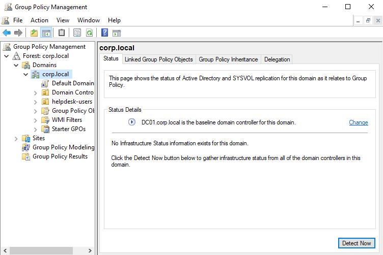
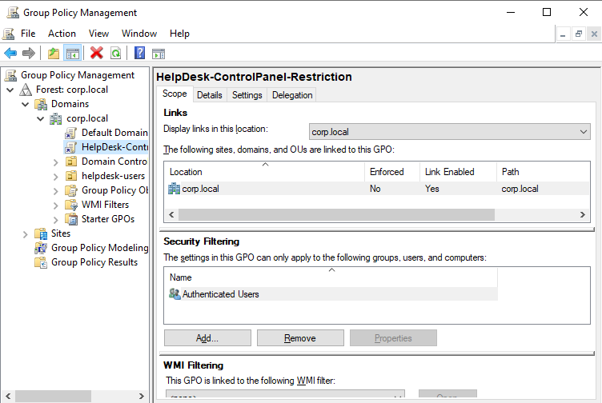
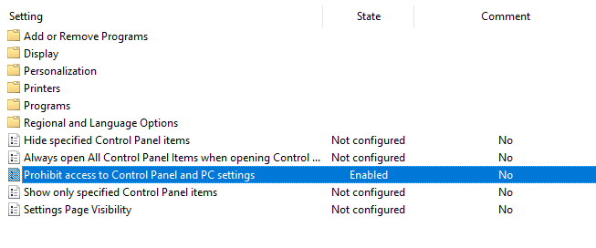
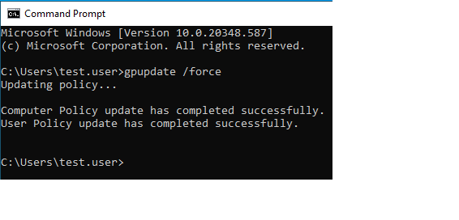
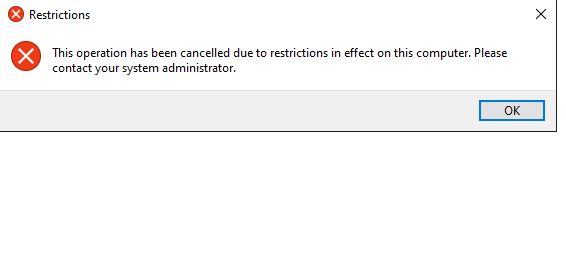

# Active Directory: Implementing Group Policy Objects (GPO)

## Scenario
In an enterprise environment, allowing standard users access to system configuration tools like the **Control Panel** or **Command Prompt** poses a significant security risk. Unauthorized changes can lead to system instability, disabled security software, or the introduction of shadow IT. 

**Objective:** Implement the **Principle of Least Privilege (PoLP)** by creating and enforcing a Group Policy Object (GPO) that restricts Control Panel access for all non-administrative users in the `corp.local` domain.

### Tools Used
* **Windows Server 2022 (Domain Controller)**
* **Windows 11**
* **Active Directory Domain Services (AD DS)**
* **Group Policy Management Console (GPMC)**

### Policy Configuration Details
| Setting Name | Path | Value | Target OU |
| :--- | :--- | :--- | :--- |
| **Prohibit access to Control Panel** | User Configuration > Administrative Templates > Control Panel | **Enabled** | Users / Helpdesk |
| **Enforcement Method** | Group Policy Management Console (GPMC) | **GPO Link** | corp.local |

Opening the Group Policy Management Console (GPMC) to manage security rules for the corp.local domain.

Creating a new Group Policy Object (GPO) named HelpDesk-ControlPanel-Restriction to house the new security settings.

Enabling the specific setting that blocks access to the Control Panel and PC Settings for all users in the target group.

Running the gpupdate /force command on the Windows 11 client to instantly apply the new security changes without a restart.

Testing the restriction as a standard user. The system successfully blocked access with a message stating the operation was cancelled due to restrictions.

## Future Security Hardening
While restricting the Control Panel is a vital first step, a fully hardened Active Directory environment should also include:
- [ ] **Account Lockout Policy:** Prevent brute-force attacks by locking accounts after 5 failed attempts.
- [ ] **Disable CMD/PowerShell:** Restrict access for standard users to prevent script-based attacks.
- [ ] **Interactive Logon Banner:** Display a legal warning at the sign-in screen to deter unauthorized access.
- [ ] **AppLocker:** Implement application whitelisting to prevent unapproved software from running.

## Conclusion
The lab successfully demonstrated the "Least Privilege" principle. By utilizing `gpupdate /force`, the policy was applied instantly, confirming that centralized administration through AD is an efficient way to manage enterprise-wide security posture.
