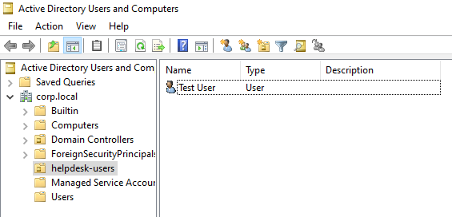
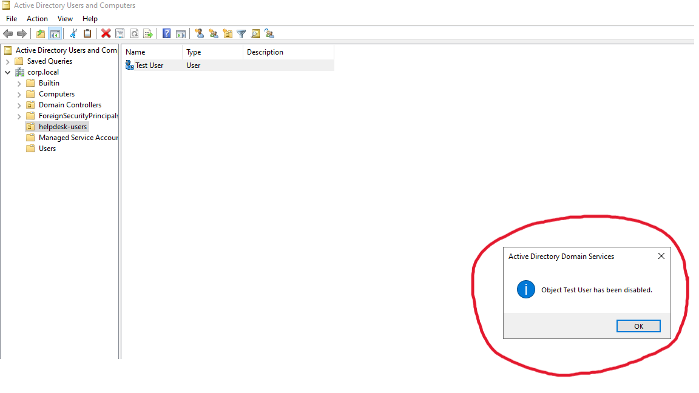
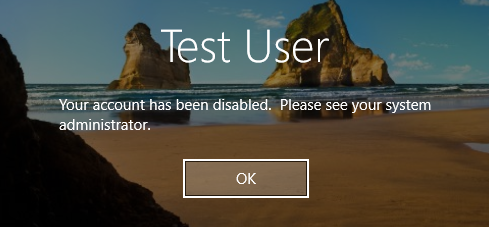
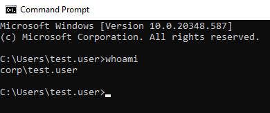
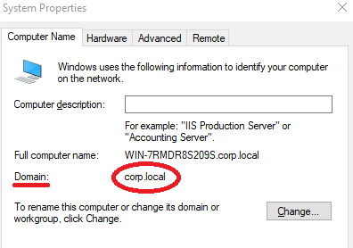
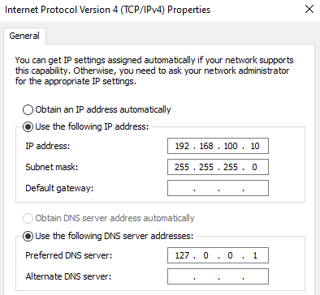
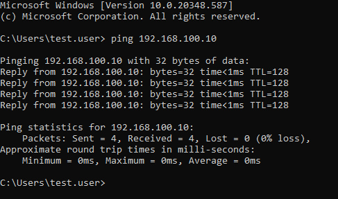

# Active Directory Home Lab

## Overview
Built a Windows Server Active Directory lab to simulate a real corporate environment.
Configured a domain controller, DNS, and a domain-joined client workstation to practice common help desk and IT support tasks.

## Lab Architecture
* **DC01** — Domain Controller
* Static IP
* DNS configured
* Active Directory Domain Services installed
* **CLIENT01** — Domain-joined workstation
* Internal network
* DNS pointing to DC01

## Technologies & Tools
* **Virtulization:** VirtualBox
* **Operating Systems:** Windows Server 2022 (Domain Controller), Windows 11 (Client Workstation)
* **Services:** AD DS (Active Directory Domain Services), DNS, DHCP
* **Domain:** corp.local 

## Configuration Steps
1. Installed Windows Server on DC01
2. Set static IP and DNS
3. Installed and configured Active Directory Domain Services
4. Created domain corp.local
5. Created Organizational Unit and test user
6. Installed Windows 11 on CLIENT01
7. Joined CLIENT01 to the domain
8. Verified domain authentication

## Help Desk Scenarios Tested
* Created and managed domain user accounts
* Disabled and re-enabled user accounts
* Reset user passwords
* Forced password change at next logon
* Tested login behavior from domain-joined client

## Key Milestones
* Active Directory user and OU management
* DNS configuration and troubleshooting
* Domain join troubleshooting
* Virtual networking (internal networks)
* Windows Server administration
* Tier 1 help desk workflows

## Screenshots

This view shows the organizational structure of the corp.local domain, specifically highlighting the creation of the helpdesk-users Organizational Unit and a test user account.

confirmation dialog box indicates that the "Test User" account was successfully disabled, simulating a common administrative security action.

The Windows login screen displays an error message explaining that the account has been disabled, preventing the user from signing into the workstation.

This screenshot captures the successful authentication of a domain user on the client machine, verifying that the workstation is communicating correctly with the Domain Controller.

The system settings menu confirms that CLIENT01 has been successfully joined to the corp.local domain.

This image shows the network adapter settings for the Domain Controller, where a static IP address and preferred DNS were manually assigned to ensure network stability.

A successful command-line ping from the client to the Domain Controller demonstrates active network connectivity and proper DNS resolution between the two virtual machines.
