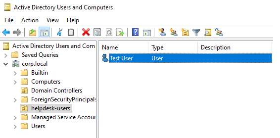
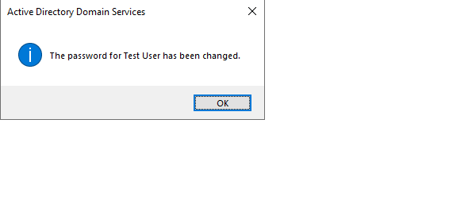
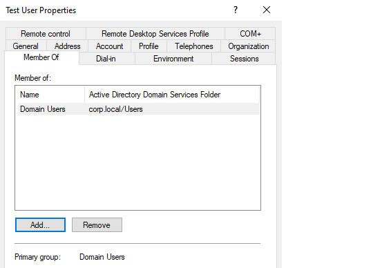

### Overview
common IT tasks using Active Directory Users and Computers in Windows Server domain.

Active Directory Users and Computers was used to manage domain user accounts.

The user password was reset and configured to require a password change at the next login.

The user was added to a security group to demonstrate role-based access management.
