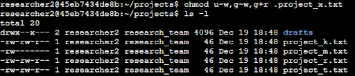
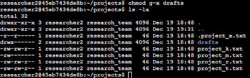
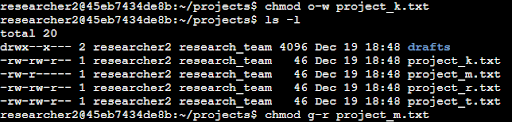

# File permissions in Linux

## Project description
My organisation's research team needs to update file permissions so they match the given authorization within the project directory. The current permissions do not reflect the appropriate level of authorization. Reviewing and updating these permissions will help maintain system security. To address this issue, I completed the following steps: 

### Check file and directory details
The image below illustrates how I used Linux commands to display the current permissions of the project file system.

The first command I used, shown in the screenshot, was used to check file permissions by displaying a detailed listing of the directory contents, including hidden files. This was accomplished using the `ls -la` command. The output contains one hidden file named `.project_x.txt`, one directory named `drafts`, and five additional project files. The leftmost column displays a 10 character permission string, which indicates the permissions assigned to each file or directory.

### Describe the permissions string
The 10-character permission string can be broken down to determine who is authorized to access a file and what level of access they have. 
* The **first character** indicates the file type: a `(d)` represents a directory, while a hyphen `(-)` represents a regular file.
* The **second through fourth characters** specify the read `(r)`, write `(w)`, and execute `(x)` permissions for the user (owner). 
* The **fifth through seventh characters** represent the read `(r)`, write `(w)`, and execute `(x)` permissions for the group. 
* The **eighth through tenth characters** indicate the read `(r)`, write `(w)`, and execute `(x)` permissions for others.

For example, the file permissions for `project_k.txt` are `-rw-rw-rw-`. The first character is a hyphen `(-)`, which indicates that `project_k.txt` is a regular file. The user, group, and other all have read and write permissions, but no execute permissions. 

### Change file permissions
The organization does not allow others to have write access to any files. Therefore, `project_k.txt` must be modified to remove write permissions from the “other” category. The image below demonstrates how I used linux commands to accomplish this. 

The first command I used shown in the screenshot was `chmod`, which changes permissions on files and directories. In this example, write permissions were removed from the “other” category for the `project_k.txt` file. The second command I used was `ls -la` to review the updated files. The output confirms that `(w)` is no longer present as the 9th character. 

### Change file permissions on a hidden file
The research team at my organisation has recently archived `.project_x.txt`, which is why it's a hidden file. They do not want this project to have write permissions for anyone, although the user and group should have read access. The image below shows the Linux commands I used to update the permissions.

The first command I used in the screenshot was used to remove write permissions from both the user and group, as well as to add read permissions to the group. I removed write permissions from the user with `u-w`. Then, I removed write permissions from the group with `g-w`, and added read permissions to the group with `g+r`. 

### Change directory permissions
The organization requires that only the `researcher2` user has access to the `drafts` directory and its contents. Therefore, I changed the permissions so that no user other than `researcher2` has execute permissions. The image below demonstrates how I used linux commands to modify directory permissions. 

I used the `chmod` command to remove execute permissions from the “group” category in the `drafts` directory. Since `researcher2` already has execute permissions, no additional permissions needed to be added. This confirms that only `researcher2` has execute permissions. 

## Summary
In this task, I reviewed the existing file and directory permissions within the project directory to ensure they matched the organization’s authorization requirements. Using Linux commands such as `ls -la` and `chmod`, I identified improper permissions and updated them to restrict write access for others, secure a hidden archived file, and limit directory access to only the authorized user. These changes ensure that files and directories are accessible only to approved users and help maintain the system’s overall security.
