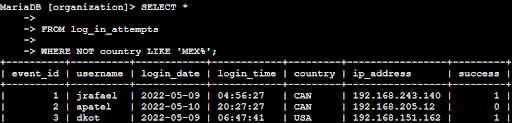

# Project: Apply filters to SQL queries

## Project description
My organization is working to improve the security of its systems. As a security professional, it is my responsibility to investigate potential security issues, analyze system activity, and help ensure employee devices remain secure. In this project, I used SQL filters to examine data from the employees and log_in_attempts tables to identify activity that could pose a security risk. The following steps demonstrate how SQL was used to retrieve and analyze relevant records.

---

## Retrieve after hours failed login attempts
There was a potential security incident that occurred after business hours, so it was necessary to review failed login activity that took place after 18:00. To investigate this issue, I created a SQL query to identify all unsuccessful login attempts that occurred after normal business hours.

The query begins by selecting all records from the log_in_attempts table. A WHERE clause is then used with an AND operator to filter the results. The first condition, login_time > '18:00', limits the output to login attempts that occurred after 18:00. The second condition, success = FALSE, filters the results to include only failed login attempts. Together, these filters return only after-hours login attempts that were unsuccessful and may require further investigation.

### SQL Query & Results:

---

## Retrieve login attempts on specific dates
A suspicious event occurred on 2022-05-09, so it was necessary to review login activity from that date as well as the day before. To investigate this event, I created a SQL query to retrieve all login attempts that occurred on 2022-05-09 or 2022-05-08.

The query selects all records from the log_in_attempts table and uses a WHERE clause with an OR operator to filter the results by date. The condition login_date = '2022-05-09' retrieves login attempts from the day the incident occurred, while login_date = '2022-05-08' retrieves login attempts from the previous day. Using the OR operator ensures that login attempts from either date are included in the output.

### SQL Query & Results:

---

## Retrieve login attempts outside of Mexico
There has been suspicious login activity, and it was determined that the activity did not originate in Mexico. To continue the investigation, I created a SQL query to retrieve all login attempts that occurred outside of Mexico.

The query selects all records from the log_in_attempts table and uses a WHERE clause to exclude login attempts originating from Mexico. The condition WHERE NOT country LIKE 'MEX%' filters out any records where the country value begins with MEX, which accounts for both MEX and MEXICO. This ensures that only login attempts from countries other than Mexico are included in the results.

### SQL Query & Results:

---

## Retrieve employees in Marketing
To perform security updates on specific employee machines, it was necessary to identify employees in the Marketing department who are located in offices within the East building. To retrieve this information, I created a SQL query using filters on the employees table.

The query selects all records from the employees table and applies a WHERE clause with an AND operator to narrow the results. The condition department = 'Marketing' filters for employees who work in the Marketing department. The condition office LIKE 'East%' filters for offices located in the East building by matching office values that begin with East. Together, these filters return only employees in Marketing who are assigned to offices in the East building.

### SQL Query & Results:

---

## Retrieve employees in Finance or Sales
To perform a different security update, it was necessary to identify employees who work in either the Sales or Finance departments. To retrieve this information, I created a SQL query that filters employee records based on department.

The query selects all records from the employees table and uses a WHERE clause with an OR operator to filter the results. The condition department = 'Sales' retrieves employees in the Sales department, while department = 'Finance' retrieves employees in the Finance department. Using the OR operator ensures that employees from either department are included in the output.

### SQL Query & Results:

---

## Retrieve all employees not in IT
To complete the final security update, it was necessary to identify employees who are not in the Information Technology department, since employees in IT have already received this update. To retrieve this information, I created a SQL query that filters employee records by department.

The query selects all records from the employees table and uses a WHERE clause to exclude employees in the Information Technology department. The condition NOT department = 'Information Technology' is used to remove IT employees from the results, ensuring that only employees from all other departments are included and identified for the update.

### SQL Query & Results:

---

## Summary
In this project, I used SQL filters to investigate potential security issues related to login attempts and employee machines. By querying the log_in_attempts table, I identified suspicious login activity based on time, date, and location. I also queried the employees table to retrieve employee information needed to perform targeted security updates. Together, these tasks demonstrate how SQL can be used to support security investigations and system maintenance.
